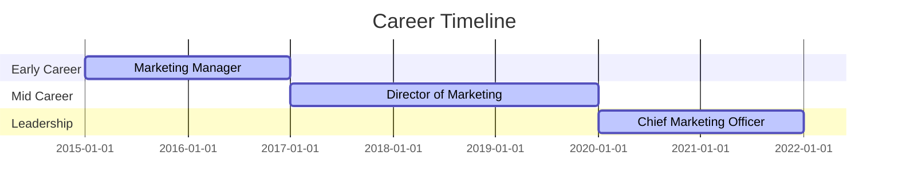
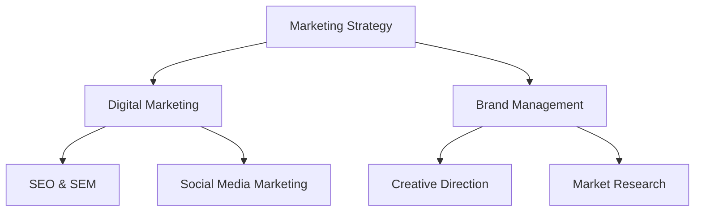

````markdown
# Hi, I'm B. Calderon Morales

I'm a passionate marketing leader with extensive experience in digital marketing, brand management, and strategic innovation. My career has been driven by a commitment to creative storytelling and data-driven strategy, helping brands connect with their audiences in meaningful ways.

## Professional Timeline

Below is a visual representation of my career progression. *(The dates and titles below are illustrative—please update them with your actual milestones.)*



## Skills & Expertise

Here's a quick visual overview of my core skills and areas of expertise:



## Projects & Initiatives

Throughout my career, I've led innovative projects that bridge creative marketing with data analytics, fostering growth and engagement for diverse brands. My approach combines strategic planning with hands-on execution, ensuring every campaign resonates with its target audience.

## Connect with Me

For a more detailed look at my professional journey and accomplishments, visit my [LinkedIn profile](http://linkedin.com/in/bcalderonmorales-cmoe).

---

Feel free to explore my repositories to see my work in action!