# 👋 Code Voyeur's Lair 

```mermaid
graph TD
    A[Visitor] --> B{Interests?}
    B -->|Code| C[Tech Radar ↓]
    B -->|Laughs| D[Meme Vault ↓]
    B -->|Collab| E[Contribution Flow ↓]
```

## 🛠️ Tech Arsenal Radar

## 🚀 Contribution Workflow

## 🧠 Knowledge Matrix

## 📌 Live Project Map

## 📚 Academic Synergy

---

🔍 **Deep Dive Links**  
 

---

> "The environment should amplify your flow - not fight it. Unless you're fighting prod bugs. Then gloves off."  
> *- Latest Wisdom Drop*