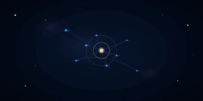

  <em>Art has many forms.</em>

  

<em>I like to help people find their art.</em>

# Brandon A. Calderon Morales

Product-Minded Software Engineer <em>w/ 4 years of XP</em>

Quick Intro

Once a U.S. Marine managing legal cases, I'm now a self-taught software engineer pursuing a computer science degree. I love turning messy problems into reliable systems and documenting what I learn along the way.

Current Projects & Interests

- **Terminal Jarvis**:
  

  - A unified command center for AI coding tools. Manage and run claude-code, gemini-cli, qwen-code, opencode, llxprt, codex, and crush from one beautiful terminal interface. 
  - [repo](https://github.com/BA-CalderonMorales/terminal-jarvis): Official Terminal Jarvis repository for folks to fork, explore, and contribute to.
  - [npm](https://www.npmjs.com/package/terminal-jarvis): Official npm package for folks to download the project and test it out on their local.
  - [crates](https://crates.io/crates/terminal-jarvis): Official crates(dot)io package for folks to download the project and test it out on their local.

- **Docs-as-Code Portfolio:** [My Life as a Dev](https://ba-calderonmorales.github.io/my-life-as-a-dev/) ([repo](https://github.com/BA-CalderonMorales/my-life-as-a-dev)) showcases MkDocs Material with a custom AI plugin.

Experiments

 

Actively testing the actual might of every AI CLI, LLM, SLM, etc. against these three mock levacy repos.

If these still suck, it's because AI in general still is isn't quite there.

- **Immersive Awe Canvas:** [repo](https://github.com/BA-CalderonMorales/immersive-awe-canvas): for interactive 3D experiments.
  - [PROD](https://immersive-awe-canvas.lovable.app): If broken, visit fallback QA link.
  - [QA](https://ba-calderonmorales.github.io/immersive-awe-canvas): If broken, feel free to contact me to see what's happening.

- **Shadow Scroll Blossom:** [repo](https://github.com/BA-CalderonMorales/shadow-scroll-blossom): is my creative coding playground.
  - [PROD](https://shadow-scroll-blossom.lovable.app/): If broken, visit fallback QA link.
  - [QA](https://ba-calderonmorales.github.io/shadow-scroll-blossom): If broken, feel free to contact me to see what's happening.

- **Rust Terminal Forge:** [repo](https://github.com/BA-CalderonMorales/rust-terminal-forge): idea that merges Rust tooling with a React interface.
  - [PROD - Unstable](https://rust-terminal-forge.lovable.app/): Currently broken, working on a fix. Visit QA below to keep track of updates.
  - [QA](https://ba-calderonmorales.github.io/rust-terminal-forge/): If broken, feel free to contact me to see what's happening.

Engineering Philosophy

- Documentation deserves the same care as code. I version and test it like any other artifact.
- Modernizing legacy systems is a challenge I enjoy – there's satisfaction in making old code new again.
- Code should deliver real value, so I approach problems with a product mindset.

Beyond the Keyboard

I'm bilingual (English/Spanish), a lifelong learner, and a fan of automating everyday tasks. You'll often find me experimenting with new tooling or helping teammates master their workflows.

Let's Connect

- Check out my docs site for a deeper dive into my projects and experiments.
- Feel free to connect on [LinkedIn](https://www.linkedin.com/in/bcalderonmorales-cmoe/). Mention GitHub so I know where you found me.
- Open an issue or start a discussion in this repo if you have questions or just want to say hi.

Cheers!
